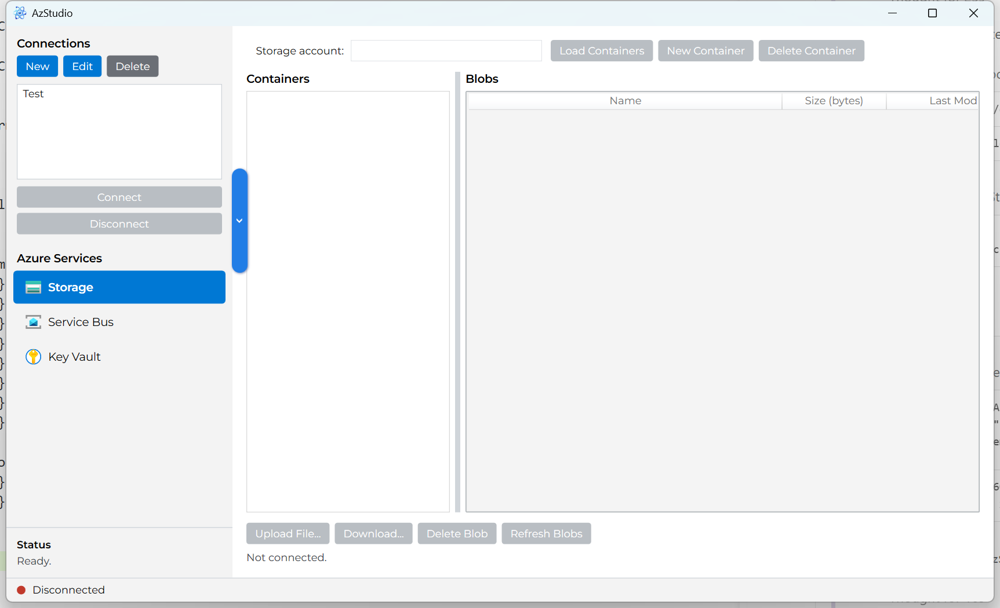

# AzStudio

A desktop GUI for connecting to Azure services, currently supporting **Blob Storage**, **Service Bus**, **Key Vault**, and **Log Analytics**. Ships as two apps: a Windows-only WPF build, and a cross-platform Avalonia build that also runs on Linux and macOS.



## Use cases

- **Spot-check production data without broad access.** A support engineer or on-call responder who's been granted read-only access to one specific container, queue, or vault can inspect it directly — no Azure Portal access, no subscription-wide role needed.
- **Runs on a locked-down Windows Server or jump box.** A single self-contained `.exe`, no installer, no Azure CLI or PowerShell modules required — useful anywhere installing tooling is a hassle or against policy.
- **Debug Service Bus message flow.** Peek queue/topic messages — including dead-letter — non-destructively to diagnose a stuck consumer or a poison message, and send a test message to reproduce an issue.
- **Audit secret rotation in Key Vault.** See every version of a secret, when each was created, activated, and expires, and reveal one on demand (masked by default, explicit "Show") to confirm a rotation actually took effect.
- **A lighter alternative to Storage Explorer / Service Bus Explorer / the Portal** for the common day-to-day cases, without the overhead of the larger tools.

## Why a narrow role is enough — control plane vs. data plane

You don't need broad access to use AzStudio, and granting someone access to it doesn't have to mean granting them visibility into anything else in the subscription. Azure separates *managing* a resource from *using the data inside it* into two layers:

- **Control plane** — creating, deleting, configuring, or listing resources: "what storage accounts exist in this subscription", "what's this vault's network configuration". This is what roles like *Contributor*, *Owner*, or *Storage Account Contributor* grant.
- **Data plane** — reading and writing the actual data inside a resource you already know the name of: a blob, a queue message, a secret. This needs its own, separate role — *Storage Blob Data Reader*, *Azure Service Bus Data Receiver*, *Key Vault Secrets User* — no matter how much control-plane access someone has. A *Contributor* or *Owner* role does **not** grant this automatically; see "Notes on authentication" below.

In practice: someone can be handed a role that lets them read blobs in one specific storage account, or peek messages on one specific queue, or read secrets from one specific vault — without ever being able to see what else exists in the subscription, list other resources, or change any configuration. AzStudio is built around exactly this: every "connect directly" field (storage account, namespace, vault name) only requires you to already know the name — it never needs "discovery" permissions to find it for you. So the right way to grant someone AzStudio access is a **data-plane role scoped to the one resource they need**, nothing broader.

## Supported services

- **Azure Blob Storage** — browse containers/blobs, upload, download, delete.
- **Azure Service Bus (Queues and Topics)** — connect directly to a named queue, or a named topic + subscription, then peek messages (non-destructive) or send a test message. Check **View dead-letter messages** to peek a queue's or subscription's dead-letter sub-queue instead of its main queue. Double-click any message row to see its full details — content type, correlation/session/partition IDs, delivery count, TTL/expiry, application properties, and the untruncated body.
- **Azure Key Vault** — list secrets and, per secret, every version with its status (enabled/disabled), activation date, and expiration date. Select a version and click **View Value...** to reveal it — masked by default with an explicit **Show**/**Hide** toggle and a **Copy to Clipboard** button, since a secret's value is materially more sensitive than its metadata.
- **Azure Log Analytics** — run a KQL query against a workspace over a chosen time range (presets from Last 30 minutes to Last 30 days, or a custom date range) and browse the results in a grid. A workspace is addressed by its **Workspace ID** (a GUID, from its Overview page in the portal) rather than a friendly name — Log Analytics' query API has no name-based endpoint. Results columns are whatever the query returns, so the grid's columns aren't fixed like the other panels'.

Two authentication modes are supported per saved connection:

- **Service Principal** — Tenant ID, Client (App) ID, Client secret. Only the Tenant ID and Client ID are saved with the connection; the client secret is never persisted anywhere, so you're prompted for it the first time you **Connect** with this profile in a given run of the app.
- **Sign in as user (Azure AD)** — interactive browser sign-in (MSAL via `Azure.Identity`). No token or account is cached to disk, so the first **Connect** for a profile in a given run always opens a fresh browser sign-in. The connection editor only asks for a Tenant ID in this mode — Client ID is a Service-Principal-only concept.

Either way, restarting the app always starts clean — see "Why sign-in shouldn't ask twice" below for exactly how long a sign-in is remembered.

### Navigating: Connections vs. Azure Services

The left pane has two blocks. **Connections** (top) is where you pick/manage the saved identity and click **Connect**/**Disconnect** — a small status dot next to the bottom status bar turns green once connected, red otherwise. **Azure Services** (below it, enabled once connected) is where you pick which service's panel shows on the right — **Storage**, **Service Bus**, **Key Vault**, or **Log Analytics**, each with its own icon. Switching between them doesn't reconnect or lose state; each service panel keeps its own account/namespace/vault/workspace field and last-loaded data independently. Where a panel shows a list next to its detail view (Containers/Blobs, Secrets/Versions), drag the divider between them to resize.

### Connecting to a specific storage account / Service Bus namespace / key vault

A saved connection is just an identity (an auth mode + tenant, and optionally a default account/namespace/vault name). The resource you actually browse is typed directly into the **Storage account** / **Namespace** / **Key vault** field on each service panel and can be changed at any time without editing or re-creating the connection. Clicking **Connect** in the left panel only establishes the Azure AD identity; it also auto-loads Blob Storage if a default storage account name was saved on the profile.

### Why sign-in shouldn't ask twice

For **Sign in as user (Azure AD)**, clicking **Connect** performs one lightweight sign-in up front (`InteractiveBrowserCredential.AuthenticateAsync()` — establishing the account, not requesting any specific Azure resource's token). That anchors the account in the one `InteractiveBrowserCredential` instance used for the rest of that connected session, which is what lets every later request, for Storage, Service Bus, Key Vault, *or* Log Analytics (they're separate token audiences), silently resume the same signed-in account instead of independently deciding it needs its own fresh interactive prompt.

`MainViewModel` then keeps that resulting credential (and, for Service Principal, the one built from the entered secret) in a plain in-memory dictionary keyed by connection ID — never written to disk — for as long as the app process stays alive. So within one run of the app: the *first* **Connect** for a given saved connection authenticates (browser sign-in, or client-secret prompt); every **Disconnect** → **Connect** after that for the *same* connection, and every switch between the Storage/Service Bus/Key Vault/Log Analytics tabs, reuses that cached credential with no re-authentication at all. Editing a connection's auth type/tenant/client ID, or restarting the app, always clears that cache, so the next Connect for it starts fresh. Nothing credential-shaped is ever written to disk at any point — only non-secret profile metadata (name, tenant/client ID, default resource names) lives in `profiles.json`.

If Connect still prompts you twice, or a specific service still fails to authenticate, check first whether the error is actually about authentication — errors that look like a permissions problem are sometimes really something else, and the app's status message tries to say which:

- A DNS/network reachability failure (e.g. "the requested name is valid but no data of the requested type was found" for `<account>.blob.core.windows.net`) means the name doesn't resolve — often a private-endpoint account that needs to be reached over VPN/private DNS, or a typo'd name — not a 401/403.
- A `403 AuthorizationPermissionMismatch` (Storage) or `403 Forbidden` (Key Vault) means the signed-in identity has a control-plane role but not the separate data-plane role the operation actually needs — see "Why a narrow role is enough" above. The status message names the specific role to ask for, and a **Copy error details** button puts the full technical details (including a timestamp and the exact failing operation) on the clipboard to hand to an admin.

### Service Bus: connect directly

Enter the namespace and a queue name (or a topic + subscription name), then Peek/Refresh/Send right there — no listing of the namespace's contents involved, and no namespace-wide "manage" rights needed. Peek/Refresh/Send only enable once the relevant field has text. This is the only way in by design: Azure Service Bus requires namespace-wide rights just to *list* what queues/topics exist, which is stricter than (and separate from) the RBAC that lets you send/peek on one specific entity you already know the name of — so a listing UI would need permissions most users granted access to one queue simply don't have.

## Solution layout

```
AzStudio.sln
src/
  AzStudio.Core/      Auth, profile storage, and Azure service wrappers (no UI dependency)
  AzStudio.App/        WPF (.NET 8, Windows-only) desktop UI
  AzStudio.Avalonia/   Avalonia (.NET 8, cross-platform) desktop UI — Windows, Linux, macOS
```

`AzStudio.Core` is deliberately UI-agnostic (plain `net8.0`, no Windows-only APIs) so both UI layers — and any future one — can share it without touching each other's plumbing:

- `Auth/CredentialFactory.cs` builds a `TokenCredential` from a `ConnectionProfile` — every service should authenticate through this.
- `Storage/BlobStorageService.cs`, `ServiceBus/ServiceBusService.cs`, `KeyVault/KeyVaultService.cs`, and `LogAnalytics/LogAnalyticsService.cs` are thin wrappers around the Azure SDK clients. A new service (e.g. Cosmos DB) follows the same pattern: a `*Service` class in Core taking a `TokenCredential`, plus a `*TabViewModel` and a panel in each UI project.
- `Profiles/ProfileStore.cs` persists connections to `%APPDATA%\AzStudio\profiles.json` (or the platform-equivalent app-data folder on Linux/macOS). No credential material is ever written there — only non-secret metadata (name, tenant/client ID, default target resource names). A Service Principal's client secret is asked for fresh on every Connect and only ever held in memory.

## Building

Requires the .NET 8 SDK.

```powershell
dotnet build AzStudio.sln
```

## Running from source

```powershell
# WPF (Windows only)
dotnet run --project src/AzStudio.App/AzStudio.App.csproj

# Avalonia (Windows, Linux, macOS)
dotnet run --project src/AzStudio.Avalonia/AzStudio.Avalonia.csproj
```

## Publishing a standalone executable

Each command below produces a single self-contained file with the .NET runtime bundled in — no separate runtime install needed on the target machine. `AzStudio.Avalonia` is plain `net8.0`, so every RID below cross-publishes cleanly from a single machine regardless of host OS.

```powershell
# WPF, Windows only
dotnet publish src/AzStudio.App/AzStudio.App.csproj -c Release -r win-x64 --self-contained true `
  -p:PublishSingleFile=true -p:IncludeNativeLibrariesForSelfExtract=true -o publish/app-win-x64

# Avalonia, one command per target OS/architecture
dotnet publish src/AzStudio.Avalonia/AzStudio.Avalonia.csproj -c Release -r win-x64 --self-contained true `
  -p:PublishSingleFile=true -p:IncludeNativeLibrariesForSelfExtract=true -o publish/avalonia-win-x64
dotnet publish src/AzStudio.Avalonia/AzStudio.Avalonia.csproj -c Release -r linux-x64 --self-contained true `
  -p:PublishSingleFile=true -p:IncludeNativeLibrariesForSelfExtract=true -o publish/avalonia-linux-x64
dotnet publish src/AzStudio.Avalonia/AzStudio.Avalonia.csproj -c Release -r osx-x64 --self-contained true `
  -p:PublishSingleFile=true -p:IncludeNativeLibrariesForSelfExtract=true -o publish/avalonia-osx-x64
dotnet publish src/AzStudio.Avalonia/AzStudio.Avalonia.csproj -c Release -r osx-arm64 --self-contained true `
  -p:PublishSingleFile=true -p:IncludeNativeLibrariesForSelfExtract=true -o publish/avalonia-osx-arm64
```

## Releases

[.github/workflows/release.yml](.github/workflows/release.yml) builds all of the above and attaches them to a new [GitHub Release](../../releases) whenever a change under `src/` lands on `main` (or on demand via **Actions → Release → Run workflow**). Each release ships a Windows WPF build plus Avalonia builds for Windows, Linux, and macOS (Intel and Apple Silicon).

## Notes on authentication

- **Service Principal**: needs an Azure AD app registration with a client secret, and appropriate **data-plane** RBAC roles on the target resources — e.g. *Storage Blob Data Reader/Contributor* on the storage account, *Azure Service Bus Data Owner/Receiver/Sender* on the namespace, *Key Vault Secrets User* on the vault.
- **Interactive user sign-in**: uses `Azure.Identity`'s built-in developer sign-in app by default (no app registration required to get started). If your tenant restricts sign-in to specific registered apps, set a custom **Client (App) ID** on the connection (a public client / mobile & desktop app registration with the appropriate delegated API permissions) — the Client ID field only appears when Service Principal is selected, since a custom client ID is an advanced, optional override for interactive sign-in.
- Both modes ultimately just produce a `TokenCredential`, so RBAC — not the sign-in method — is what determines what a connection can actually see or do. Management-plane roles (*Owner*, *Contributor*, *Storage Account Contributor*) do **not** substitute for the data-plane roles above, no matter how broad they look — see "Why a narrow role is enough" above.

## Adding a new service module later

1. Add a `*Service` wrapper class under `AzStudio.Core` that takes a `TokenCredential` (see `BlobStorageService` or `KeyVaultService` for the shape).
2. Add a matching `*TabViewModel` under `AzStudio.App/ViewModels` with an `Activate(TokenCredential credential, string defaultTarget)` / `Deactivate()` pair and an `EnsureService()` helper that (re)builds the `*Service` from whatever name is currently typed into the tab, following `BlobStorageTabViewModel`. This is what lets the user type/change the target resource name after connecting instead of baking it into the saved profile.
   - **Important:** a `[RelayCommand]`'s enabled state only re-evaluates when explicitly told to, or when an `[ObservableProperty]` with `[NotifyCanExecuteChangedFor]` changes. Since `CanExecute` here depends on plain fields (`_credential`, `_service`) rather than observable properties, every place that mutates those fields (`Activate`, `Deactivate`, `EnsureService`) must call a `NotifyServiceCommands()` helper that invokes `.NotifyCanExecuteChanged()` on each affected command — otherwise the buttons stay stuck disabled even after a successful connect.
3. Wire it into `MainViewModel` (a new tab view-model property, an `IsXSelected` bool, and `Activate`/`Deactivate` calls in `ConnectAsync`/`Disconnect`), then in `MainWindow.xaml` add a nav `RadioButton` (with an icon — see `Assets/Icons/`) and a `Grid` panel whose `Visibility` binds to that `IsXSelected` flag, following the Storage or Key Vault panel as a template.
4. If the new service needs its own default target field (like `StorageAccountName`), add it to `ConnectionProfile` and to the connection editor dialog.
